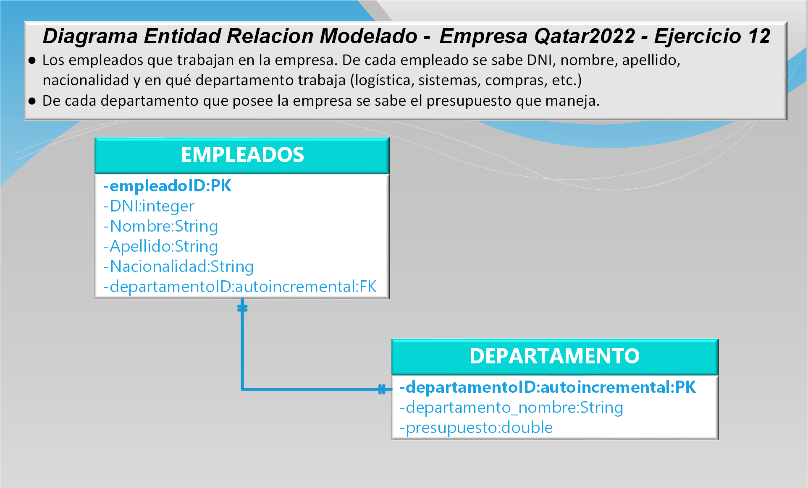

# **Prácticas - ARGENTINA PROGRAMA 4.0** 
------

# **Clase 12: PERSISTENCIA RELACIONAL**

## **DER Qatar2023**  

La empresa Qatar2022, desea realizar un sistema que permita almacenar la siguiente
información:

- Los empleados que trabajan en la empresa. De cada empleado se sabe DNI, nombre, apellido, nacionalidad y en qué departamento trabaja (logística, sistemas, compras, etc.)

- De cada departamento que posee la empresa se sabe el presupuesto que maneja.

1. Realizar el modelo relacional del enunciado propuesto

  

------
